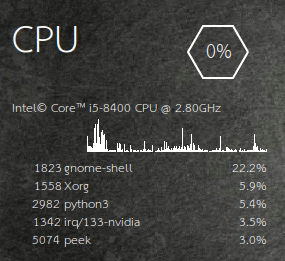

<h1 align="center">
   
  
   
</h1>

<h3 align="center">Desktop Widget Manager</h3>

Think of Conky, but with Python instead of Lua.

  
  
  
  
  
  

  
  &nbsp;&nbsp;&nbsp;&nbsp;
  <!-- 
  &nbsp;&nbsp;&nbsp;&nbsp;
   -->

  <a href="#synopsis"><b>Synopsis</b></a>&nbsp;&bull;
  <a href="#requirements"><b>Requirements</b></a>&nbsp;&bull;
  <a href="#installation"><b>Installation</b></a>&nbsp;&bull;
  <a href="#usage"><b>Usage</b></a>

## Synopsis

The **Blighty** project is inspired by Conky. In essence, it is a collection of
objects that allow you to quickly create a transparent window that you can draw
on with cairo. But instead of coding your widgets in Lua, that perhaps end up
calling Python as external tools, you can now code them natively in Python.

Performance won't be as great as Conky, with probably more resource being used
for the same end result, but native Python support opens up for a lot more
customisation possibilities in a snap of your fingers.

There won't be much you can do with minimal effort out of the box while the
project is in its infancy. If you like the idea, you are more than welcome to
contribute to this project!

## Requirements

- X11
- Xinerama
- cairo
- python3
- python3-gi (only for GTK Windows)
- gir1.2-gtk-3.0 (only for GTK Windows)
- gir1.2-glib-2.0 (only for GTK Windows)

## Installation

Currently, Blighty needs to be built from its source code. The following
installation instructions have been tested on Ubuntu 18.04. If you are using a
different distribution, make sure that you install all the listed dependencies
from your package repository.

To install the required dependencies, use the following command

~~~
sudo apt install xorg libxinerama-dev libcairo2-dev python3-gi gir1.2-gtk-3.0 gir1.2-glib-2.0
~~~

To install Blighty from PyPI, use the command

~~~
sudo -H python3 -m pip install blighty --upgrade
~~~

Should you encounter any problems installing Blighty from PyPI, then install it
directly from GitHub with the following command.

~~~
sudo -H python3 -m pip install git+https://github.com/P403n1x87/blighty.git --upgrade
~~~

## Usage

The official documentation is hosted on
[ReadTheDocs.io](https://blighty.readthedocs.io/en/latest/). Refer to the code
in the `examples` folder for some simple examples.

This package makes it easy to create transparent windows that you can draw on
with `cairo`. It takes all the boilerplate code away from you so that you can
just focus on the artwork, pretty much as with Conky.

### X11 Canvases

This is the closest to Conky that you can get for the moment, and the
recommended way of using Blighty. Use the following approach to create a window
with the Xlib directly.

~~~ python
from blighty import CanvasGravity
from blighty.x11 import Canvas, start_event_loop

class MyCanvas(Canvas):
  def on_draw(self, context):
    # context is an instance of a cairo context.
    # Refer to the Pycairo documentation.

if __name__ == "__main__":
  x, y, width, height = 10, 10, 200, 200

  # Instantiate the canvas
  canvas = MyCanvas(10, 10, width = 200, height = 200, gravity = CanvasGravity.SOUTH_EAST)

  # Map it on screen
  canvas.show()

  # Start the event loop
  start_event_loop()
~~~

The module implements a basic event loop so that the user interactions with the
canvas can be handled. You can capture key and button presses by implementing
the `on_key_pressed(self, keysym, state)` and `on_button_pressed(self, button,
state, x, y)` method in your subclass of `Canvas`.

### GTK Canvases

To create GTK-based canvases you can use the `blighty.gtk.Canvas` class, which
is just a subclass of `Gtk.Window`.

~~~ python
from time import sleep
import blighty.gtk as b

class MyCanvas(b.Canvas):
    def on_draw(self, widget, cr):
        # Similar to the X11 case. However, note how
        # you have access to the whole GTK window
        # via the `widget` parameter. In principle you
        # can exploit it to add extra child widgets.
        # Use wisely.

if __name__ == "__main__":
    canvas = MyCanvas(0, 0, width=320, height=240)
    canvas.show_all()
    b.start_event_loop()
~~~

### Animations

Animations can be controlled via the `Canvas.interval` attribute. This is the
time in milliseconds that elapses between consecutive redraws of the Canvas.

### Brushes

_Since version 1.1.0_.

Consider the following simple example of a clock widget.

~~~ python
from blighty import CanvasGravity
from blighty.x11 import Canvas, start_event_loop

import datetime

from math import pi as PI

class Clock(Canvas):
    def on_button_pressed(self, button, state, x, y):
        self.dispose()

    def hand(self, ctx, angle, length, thickness):
        ctx.save()
        ctx.set_source_rgba(1, 1, 1, 1)
        ctx.set_line_width(thickness)
        ctx.rotate(angle)
        ctx.move_to(0, length * .2)
        ctx.line_to(0, -length)
        ctx.stroke()
        ctx.restore()

    def on_draw(self, ctx):
        now = datetime.datetime.now()

        ctx.translate(self.width >> 1, self.height >> 1)

        self.hand(ctx,
            angle = now.second / 30 * PI,
            length = (self.height >> 1) * .9,
            thickness = 1
        )

        mins = now.minute + now.second / 60
        self.hand(ctx,
            angle = mins / 30 * PI,
            length = (self.height >> 1) * .8,
            thickness = 3
        )

        hours = (now.hour % 12) + mins / 60
        self.hand(ctx,
            angle = hours / 6 * PI,
            length = (self.height >> 1) * .5,
            thickness = 6
        )
~~~

It is clear that the `hand` method would be more appropriate for the instance of
the cairo Context `ctx`. The coding would be simpler if we could call it as
`ctx.hand`. _Brushes_ allow you to re-bind methods from the `Canvas` subclass to
the cairo context. Import the `brush` decorator from `blighty` with

~~~ python
from blighty import brush
~~~

and the use it to decorate the `hand` method. The `self` argument is no longer
necessary, since it will be replaced by the cairo context instance. So the above
code becomes

~~~ python
from blighty import CanvasGravity, brush
from blighty.x11 import Canvas, start_event_loop

import datetime

from math import pi as PI

class Clock(Canvas):
    def on_button_pressed(self, button, state, x, y):
        self.dispose()

    @brush
    def hand(ctx, angle, length, thickness):
        ctx.save()
        ctx.set_source_rgba(1, 1, 1, 1)
        ctx.set_line_width(thickness)
        ctx.rotate(angle)
        ctx.move_to(0, length * .2)
        ctx.line_to(0, -length)
        ctx.stroke()
        ctx.restore()

    def on_draw(self, ctx):
        now = datetime.datetime.now()

        ctx.translate(self.width >> 1, self.height >> 1)

        ctx.hand(
            angle = now.second / 30 * PI,
            length = (self.height >> 1) * .9,
            thickness = 1
        )

        mins = now.minute + now.second / 60
        ctx.hand(
            angle = mins / 30 * PI,
            length = (self.height >> 1) * .8,
            thickness = 3
        )

        hours = (now.hour % 12) + mins / 60
        ctx.hand(
            angle = hours / 6 * PI,
            length = (self.height >> 1) * .5,
            thickness = 6
        )
~~~

By default, methods of subclasses of `Canvas` that begin with `draw_` are
re-bound to the cairo context in the `on_draw` method. So the same as the above
code could be achieved without the use of the `brush` decorator with

~~~ python
from blighty import CanvasGravity
from blighty.x11 import Canvas, start_event_loop

import datetime

from math import pi as PI

class Clock(Canvas):
    def on_button_pressed(self, button, state, x, y):
        self.dispose()

    def draw_hand(ctx, angle, length, thickness):
        ctx.save()
        ctx.set_source_rgba(1, 1, 1, 1)
        ctx.set_line_width(thickness)
        ctx.rotate(angle)
        ctx.move_to(0, length * .2)
        ctx.line_to(0, -length)
        ctx.stroke()
        ctx.restore()

    def on_draw(self, ctx):
        now = datetime.datetime.now()

        ctx.translate(self.width >> 1, self.height >> 1)

        ctx.draw_hand(
            angle = now.second / 30 * PI,
            length = (self.height >> 1) * .9,
            thickness = 1
        )

        mins = now.minute + now.second / 60
        ctx.draw_hand(
            angle = mins / 30 * PI,
            length = (self.height >> 1) * .8,
            thickness = 3
        )

        hours = (now.hour % 12) + mins / 60
        ctx.draw_hand(
            angle = hours / 6 * PI,
            length = (self.height >> 1) * .5,
            thickness = 6
        )
~~~

_Brushes_ are implemented via the class `ExtendedContext`, which is just a
wrapper around `cairo.Context`. The argument passed to the `on_draw` callback is
hence an instance of this class. For convenience, it exposes the containing
canvas instance via the `canvas` attribute so that it doesn't need to be passed
to the brush method when you need to access some of the canvas attributes (e.g.
its size) or methods.

## Conky-like Graphs

_Since version 3.0.0_

If you really can't do without the Conky look, Blighty offers you Conky-like graphs out of the box.

All you have to do is create an instance of `blighty.legacy.Graph` by specifying the position and the size of the graph. Optionally, you can also pass a `scale` argument, which by default is set to `100` and defines the _y_ scale of the graph. If you want the graph to auto-scale, use `scale=None`. You push values to the graph with the `push_value` method and draw it on a canvas with the `draw` method, which requires a Cairo context as argument.

## License

GPLv3.
